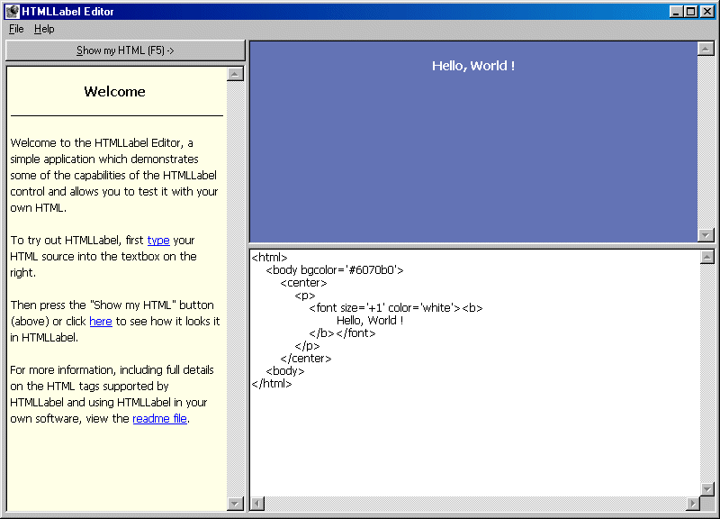



## HTMLLabel v0\.2\.0

### Description

The free, all-VB HTML rendering control. Now with support for graphics, VB URLs and more.
 
### More Info
 

             |
---                |---
**Submitted On**   |2001-10-05 22:32:44
**By**             |[Woodbury Associates](https://github.com/Planet-Source-Code/PSCIndex/blob/master/ByAuthor/woodbury-associates.md)
**Level**          |Intermediate
**User Rating**    |5.0 (45 globes from 9 users)
**Compatibility**  |VB 6\.0
**Category**       |[Internet/ HTML](https://github.com/Planet-Source-Code/PSCIndex/blob/master/ByCategory/internet-html__1-34.md)
**World**          |[Visual Basic](https://github.com/Planet-Source-Code/PSCIndex/blob/master/ByWorld/visual-basic.md)
**Archive File**   |[HTMLLabel 276571052001\.zip](https://github.com/Planet-Source-Code/woodbury-associates-htmllabel-v0-2-0__1-27836/archive/master.zip)

